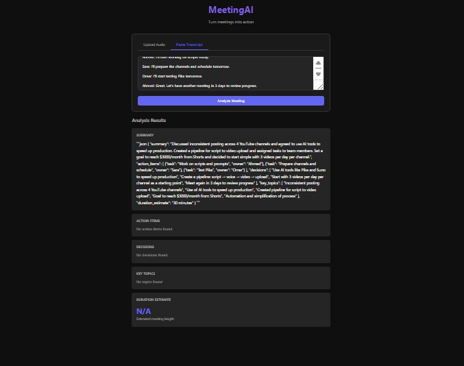

# MeetingAI 🎙️

MeetingAI is a production-ready meeting analysis platform that transforms audio recordings or text transcripts into structured, actionable insights. Using state-of-the-art AI models, it extracts summaries, action items, and key decisions in seconds.



## ✨ Features

- 🎙️ **Audio Transcription**: Upload MP3, WAV, M4A, or MP4 files for high-accuracy transcription using OpenAI Whisper.
- 📝 **Text Analysis**: Paste existing transcripts for instant AI-powered summarization.
- 📊 **Actionable Insights**: Automatically extracts executive summaries, action items (with owners and deadlines), and key decisions.
- 🔒 **Enterprise Ready**: Includes API key authentication, rate limiting, and secure file handling.
- 🚀 **Responsive UI**: Modern, clean dashboard for uploading files and viewing results.
- 🐳 **Containerized**: Fully Dockerized with multi-stage builds and health checks.

## 🛠️ Tech Stack

- **Backend**: Python 3.11, Flask
- **AI Inference**: [Groq API](https://groq.com) (Llama 3.1)
- **Speech-to-Text**: [OpenAI Whisper](https://github.com/openai/whisper)
- **Validation**: Pydantic
- **Security**: Flask-CORS, Secure Headers
- **DevOps**: Docker, Docker Compose, GitHub Actions

## 🚀 How to Run (5 Steps)

1. **Clone the repository**:
   ```bash
   git clone https://github.com/khaled24ao/meeting-ai.git
   cd meeting-ai
   ```

2. **Set up virtual environment**:
   ```bash
   python -m venv venv
   source venv/bin/activate  # Windows: venv\Scripts\activate
   ```

3. **Install dependencies**:
   ```bash
   pip install -r requirements.txt
   ```

4. **Configure environment**:
   ```bash
   cp .env.example .env
   # Edit .env and add your GROQ_API_KEY and SECRET_KEY
   ```

5. **Start the application**:
   ```bash
   python app.py
   ```
   Visit **http://localhost:7860** to see the app!

## 🐳 Docker

Run the entire stack with a single command:

```bash
docker-compose up --build
```

## ⚙️ Environment Variables

| Variable | Required | Description |
|----------|----------|-------------|
| `GROQ_API_KEY` | **Yes** | Your Groq API key from [console.groq.com](https://console.groq.com) |
| `SECRET_KEY` | **Yes** | Random string for Flask session security |
| `ALLOWED_API_KEYS` | **Yes** | Comma-separated list of keys allowed to access the API |
| `PORT` | No | Application port (default: 7860) |
| `DEBUG` | No | Enable debug mode (default: false) |
| `AI_MODEL` | No | Groq model to use (default: llama-3.1-8b-instant) |
| `WHISPER_MODEL` | No | Whisper model size: tiny/base/small/medium/large (default: tiny) |

## 📄 License

This project is licensed under the **MIT License** - see the [LICENSE](LICENSE) file for details.

---

**Built with ❤️ for efficient meetings.**